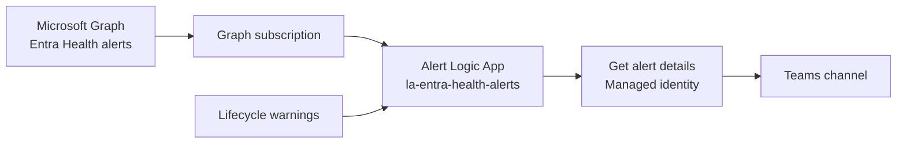
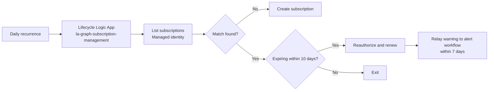

# Entra Health Monitoring

This `azd` template deploys a secret-free Microsoft Entra Health monitoring solution that subscribes to Microsoft Graph health alerts, posts them to a Microsoft Teams channel, and keeps the Graph subscription healthy with a companion lifecycle workflow. It uses Logic App managed identities for Microsoft Graph access and does not require an app registration or client secret.

## Quick Start

1. Clone the template.

```powershell
azd init -t nathanmcnulty/azd-entra-health-monitoring
```

2. Provision the solution.

```powershell
azd up
```

When prompted for `TEAMS_CHANNEL_LINK`, in Microsoft Teams right-click the target channel, select Copy link, and paste that link into the terminal.

3. When `postprovision` prints a Teams consent URL, open it, complete the sign-in flow as the user/service account the chat should come from (not the admin), return to the terminal, and press Enter when prompted. The hook waits for the connection to report ready and then continues.

When finished, the provisioning run prints the deployed Logic App names, resource group, webhook URL, and Teams connection status in the terminal.

## Architecture

The template provisions two Logic App Consumption workflows:

- `la-entra-health-alerts`
  - receives Microsoft Graph change notifications for `/beta/reports/healthmonitoring/alerts`
  - validates the webhook handshake and acknowledges notifications quickly
  - reads alert details with its managed identity
  - posts alerts to a Teams channel
  - posts a warning when a delivered notification shows the subscription expires in 7 days or less
- `la-graph-subscription-management`
  - runs daily
  - uses managed identity to create the subscription if missing
  - reauthorizes and renews 10 days before expiration
  - relays renewal failure warnings to the alert workflow starting 7 days before expiration





## What `azd up` does

`azd up` runs `azd provision`, which uses project hooks to:

1. Prompt for the alert Logic App name and Teams channel link when they are not already set.
2. Show recommended defaults inline in the custom prompts so you can press Enter to accept them or provide your own values.
3. Parse `TEAMS_CHANNEL_LINK` and store the team, channel, and tenant IDs in the `azd` environment before infrastructure parameters are resolved.
4. Prompt for the Azure subscription and let you select or create the resource group through the built-in `azd` experience.
5. Provision both Logic App Consumption workflows with system-assigned managed identities.
6. Provision a Microsoft Teams connection resource.
7. If the Teams connection needs consent, pause and wait for you to complete the browser flow and press Enter.
8. After the Teams connection is authenticated, grant the alert workflow `HealthMonitoringAlert.Read.All`.
9. Grant the lifecycle workflow `HealthMonitoringAlertConfig.ReadWrite.All`.

## Authentication

- The deployed solution is secret-free.
- The alert workflow uses managed identity for Microsoft Graph alert reads.
- The lifecycle workflow uses managed identity for Graph subscription lifecycle operations.
- The lifecycle workflow does not post to Teams directly. It relays warning messages to the alert workflow webhook.
- The Teams connector uses the user-authorized Logic Apps connection.
- The signed-in operator's delegated Graph token is used only during provisioning to grant Graph app roles to the workflows' managed identities.

## Inputs

The user provides:

- Azure subscription through the normal `azd` selection experience
- Azure resource group through the normal `azd` selection or creation experience
- Alert Logic App name
- `TEAMS_CHANNEL_LINK`

The project derives the team ID, channel ID, tenant ID, webhook URL, Logic App principal IDs, and resource IDs automatically.
