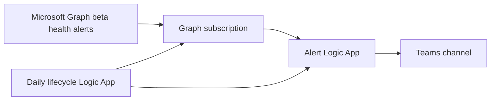

# Entra Health Monitoring

Deploy a secret-free Azure workflow that forwards Microsoft Entra health alerts to a Microsoft Teams channel and renews its Microsoft Graph subscription.

This template helps an administrator:

1. Receive Microsoft Entra health alert notifications in Teams.
2. Keep the Graph health-alert subscription renewed automatically.
3. Monitor connection and lifecycle status without storing an app secret.

> This is a beta Graph health-monitoring integration. It uses Microsoft Graph `/beta` resources and requires explicit consent for the managed-identity permissions described below.

## Quickstart

### Before you begin

Install:

- [Azure Developer CLI](https://learn.microsoft.com/azure/developer/azure-developer-cli/install-azd) 1.23.0 or later
- [Azure CLI](https://learn.microsoft.com/cli/azure/install-azure-cli)
- PowerShell 7 or later on Windows

Use an administrator who can select or create the Azure resource group and grant Microsoft Graph application permissions. The deployment needs `HealthMonitoringAlert.Read.All` for the alert workflow and `HealthMonitoringAlertConfig.ReadWrite.All` for the lifecycle workflow. Your organization may require a Privileged Role Administrator or Global Administrator to grant that consent.

Have a Microsoft Teams channel ready. During setup, copy its channel link. A user or service account must complete the browser consent for the Teams connection; use the identity that should appear as the sender of alert messages.

The normal Azure CLI and operating-system/browser sign-in flows are used. Cached sessions are reused when they match the selected tenant. Device-code authentication is never used.

### Deploy

```powershell
azd init -t nathanmcnulty/azd-entra-health-monitoring && azd up
```

The guided setup asks for an alert Logic App name and Teams channel link, lets `azd` select or create the resource group, and pauses for Teams browser consent when required. It validates that the Teams link belongs to the selected Azure tenant before provisioning.

## What gets deployed

Two Logic App Consumption workflows and one Teams API connection are created:

- An alert workflow receives Graph health-alert change notifications, reads alert details with its managed identity, and posts them to Teams.
- A lifecycle workflow runs daily, creates the Graph subscription when missing, renews it before expiration, and relays renewal warnings to the alert workflow.
- System-assigned managed identities are granted only the two Graph application roles listed above.

The deployment is secret-free: it does not create an app registration or client secret. The Teams connection is user-authorized during setup.


```mermaid
flowchart LR
  G[Microsoft Graph beta health alerts] --> S[Graph subscription]
  S --> A[Alert Logic App]
  A --> T[Teams channel]
  L[Daily lifecycle Logic App] --> S
  L --> A
```

## Verify the deployment

After `azd up`:

1. Confirm the Teams connection reports `Authenticated`, `Connected`, or `Ready`.
2. Check the printed Logic App names and resource group in the deployment summary.
3. Confirm the lifecycle workflow has a successful run in the Azure portal.
4. Send or wait for a health alert that your tenant is entitled to receive and confirm the Teams message.

Use `azd hooks run postprovision` to resume Teams consent or bootstrap steps after an interrupted run. See [operations](docs/operations.md) for status and troubleshooting.

## Documentation

| Guide | Use it for |
| --- | --- |
| [Identity and authentication](docs/identity-and-authentication.md) | Roles, Graph consent, Teams consent, and sign-in boundaries |
| [Configuration](docs/configuration.md) | Inputs, derived values, defaults, and supported automation |
| [Architecture](docs/architecture.md) | Components, identities, data flow, and beta API boundary |
| [Operations](docs/operations.md) | Verification, reruns, monitoring, troubleshooting, and cleanup |
| [Development and publishing](docs/development.md) | Contributor checks, packaging, CI, and publishing |
| [Agent-assisted deployment](docs/agent-assisted-deployment.md) | Safe administrator-plus-agent workflow |

## Cleanup

Remove the Azure resources created for the current `azd` environment:

```powershell
azd down --purge --force
```

This removes the Logic Apps, Teams connection, managed identities, and other owned Azure resources. It does not provide a tenant-side Graph subscription deletion workflow; review the subscription in Microsoft Graph and remove any remaining subscription explicitly if required by your organization.

## Security

The workflows use managed identities and no stored client secret. Review the [security boundaries](docs/identity-and-authentication.md#security-boundaries) before granting Graph admin consent, and report vulnerabilities through the repository's security policy.
